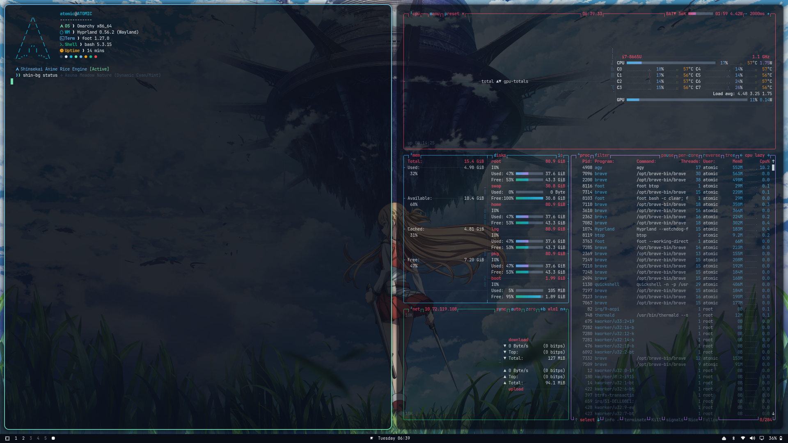
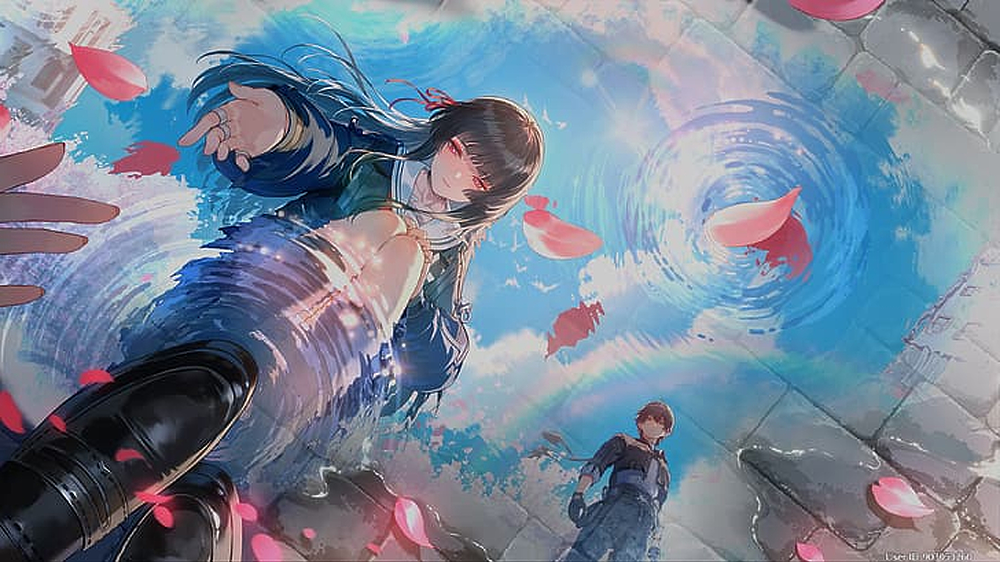
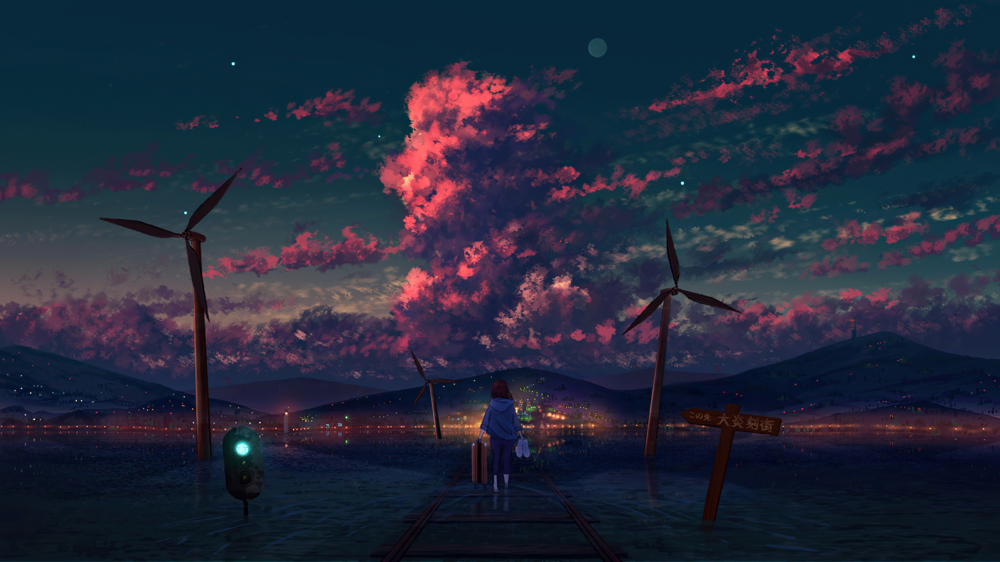

# Shinsekai (新世界) — Dynamic Anime Aesthetic Theme for Omarchy

<p align="center">
  
</p>

<p align="center">
  <strong>新世界 (Shinsekai) — <em>"New Worlds"</em></strong><br>
  A curated anime visual theme for <strong>Omarchy Linux & Hyprland</strong> featuring <strong>12 default 4K & 8K anime landscapes, celestial skies, and character art</strong> with <strong>Real-Time Dynamic Color Adaptation</strong>, a built-in <strong>CLI Wallpaper Manager</strong>, and <strong>Trash Recovery (Undo)</strong>.
</p>

<p align="center">
  
  
  
  
  
</p>

---

## Table of Contents

- [Overview](#overview)
- [Key Features](#key-features)
- [Wallpaper Gallery (12 Default Masterpieces)](#wallpaper-gallery-12-default-masterpieces)
- [Wallpaper Manager CLI (`shin-bg`)](#wallpaper-manager-cli-shin-bg)
- [Trash Recovery & Undo System](#trash-recovery--undo-system)
- [How Dynamic Theming Works](#how-dynamic-theming-works)
- [Luminance & Readability Guard](#luminance--readability-guard)
- [Terminal Download & Installation Guide](#terminal-download--installation-guide)
- [Keyboard Shortcuts](#keyboard-shortcuts)
- [Included App Styles](#included-app-styles)
- [Project File Structure](#project-file-structure)
- [License](#license)

---

## Overview

**Shinsekai (新世界)** brings together iconic anime universes into a single, cohesive desktop experience.

From vast open meadows and Lake Itomori sunsets to celestial snow peaks, wisteria mountain trails, neon moonlit skylines, and striking character art, each wallpaper brings a distinct atmosphere.

Powered by a custom **Hue-Clustered Dynamic Color Engine**, your entire system—window borders, top bar, browser accents, terminal syntax, launcher, and notifications—automatically adapts in real-time to match whichever wallpaper you choose.

Users can freely add as many custom 4K wallpapers as they want (`[01-N]`) using the built-in `shin-bg` CLI tool.

---

## Key Features

- **Real-Time Dynamic Color Adaptation**:
  - Automatically extracts dominant color palettes and gradient pairs on wallpaper change.
  - Live reloads Hyprland window borders in a single frame.
  - Updates Brave/Chromium browser theme, top bar (Omarchy QuickShell), Walker launcher, and GTK apps instantly.
- **CLI Wallpaper Manager & Quality Checker (`shin-bg`)**:
  - Add, download, quality-check (4K/8K resolution guard), and manage custom wallpapers directly from any terminal.
- **Trash Recovery & Undo System**:
  - Accidental deletions are safely preserved in recovery trash; restore anytime with `shin-bg undo` or `shin-bg restore <number>`.
- **Zero-Battery Kernel Inotify Engine**:
  - Event-driven background watcher uses pure Linux kernel inotify blocking (`0.00% CPU, 0 battery consumption`).
- **Luminance & Contrast Guard**:
  - Enforces minimum brightness (`v >= 0.88`) on all dynamically extracted accent colors.
  - Guarantees 100% crisp terminal text readability and WCAG contrast even on dark or muted backgrounds.
- **12 Curated 4K & 8K Visual Masterpieces (Expandable)**:
  - High-definition art across iconic anime universes (*Sword Art Online, Your Name, Genshin Impact, Frieren, Violet Evergarden, Studio Ghibli, Suzume, Weathering With You, Wuthering Waves, Cyberpunk Edgerunners, Demon Slayer, and Twilight Horizon*).
- **Glowing Anime Gradient Borders & Acrylic Glassmorphism**:
  - 45° glowing dual-tone active window borders with multi-pass frosted glass blur and subtle deep velvet shadows.
- **Silky Spring Animations**:
  - Snappy cubic-bezier physics transitions (`shinsekaiEase: 0.16, 1, 0.3, 1`) for window popins and workspace sliding.

---

## Wallpaper Gallery (12 Default Masterpieces)

| 01. Sword Art Online — Asuna Sunlit Meadow (4K) | 02. Your Name — Mitsuha Lake Itomori Sunset (4K) |
| :---: | :---: |
|  |  |

| 03. Genshin Impact — Columbina Celestial Snow (8K) | 04. Frieren — Blue Flower Field (4K) |
| :---: | :---: |
|  |  |

| 05. Violet Evergarden — Water Meadow (8K) | 06. Spirited Away — Sea Railway Train (4K) |
| :---: | :---: |
|  |  |

| 07. Suzume — Cosmic Starry Twilight (4K) | 08. Weathering With You — Sunshine Clouds (8K) |
| :---: | :---: |
|  |  |

| 09. Wuthering Waves — Chisa's Crimson Reach (4K) | 10. Cyberpunk Edgerunners — Moon Skyline (5K) |
| :---: | :---: |
|  |  |

| 11. Demon Slayer — Wisteria Mountain (4K) | 12. Anime Scenery — Twilight Horizon (4K) |
| :---: | :---: |
|  |  |

---

## Wallpaper Manager CLI (`shin-bg`)

Shinsekai includes a custom terminal tool to download, inspect quality, and manage wallpapers from any terminal location (`no cd required`).

### CLI Commands Reference

| Command | Action |
| :--- | :--- |
| `shin-bg` | Open interactive menu with clipboard auto-detection |
| `shin-bg list` | View all installed wallpapers with assigned numbers `[01-N]` |
| `shin-bg add <url-or-path> [name]` | Download or import wallpaper (auto-assigns next number) |
| `shin-bg set <number>` | Switch active wallpaper by number (e.g. `shin-bg set 4`) |
| `shin-bg remove <number>` | Move wallpaper to recovery trash (e.g. `shin-bg remove 13`) |
| `shin-bg restore [number]` | Undo / Restore deleted wallpaper (e.g. `shin-bg restore 13` or `shin-bg undo`) |
| `shin-bg trash` | View deleted wallpapers in recovery trash |
| `shin-bg next` | Cycle to next wallpaper |
| `shin-bg current` | Show currently active wallpaper |

---

## Trash Recovery & Undo System

If you accidentally delete a wallpaper:
- Removed wallpapers are moved to `.trash/` instead of permanent deletion.
- Run **`shin-bg undo`** to immediately restore the last deleted wallpaper.
- Or run **`shin-bg restore <number>`** to recover a specific wallpaper number.

---

## How Dynamic Theming Works

1. **Kernel Event Detection**: A background service (`shinsekai-watcher.py`) blocks in Linux kernel `inotify` sleep with **0.00% CPU / 0 battery draw**.
2. **Hue Clustering**: Quantizes wallpaper into 12 distinct Hue sectors (30° bins) to aggregate color weight and identify the true dominant atmosphere of the artwork.
3. **Full-Desktop Broadcast**:
   - Triggers `omarchy-theme-set` to update the top bar, Walker launcher, SwayOSD, and GTK apps.
   - Retints Brave/Chromium browser via policy JSON.
   - Reloads Hyprland active border gradients in 1 frame.

---

## Luminance & Readability Guard

To prevent dark or muted backgrounds from making terminal text and syntax highlighting dim:
- **Locked Foreground**: Pure starlight white (`#f8fafc`) for base text.
- **Brightness Floor (`v >= 0.88`)**: Automatically lifts dark tones into clear, luminous pastel/neon highlights.
- **Guaranteed WCAG Contrast**: Eliminates unreadable command arguments across all wallpapers.

---

## Terminal Download & Installation Guide

### Method 1: Automated Installer (Fastest)

Run the one-line installer in your terminal:

```bash
omarchy theme install https://github.com/Madhukumar511/omarchy-shinsekai-theme.git
```

Then enable the background color sync daemon and CLI tool:

```bash
mkdir -p ~/.config/systemd/user ~/.local/bin
ln -nsf ~/.config/omarchy/themes/shinsekai/shinsekai-wallpaper ~/.local/bin/shinsekai-wallpaper
ln -nsf ~/.config/omarchy/themes/shinsekai/shinsekai-wallpaper ~/.local/bin/shin-bg
ln -nsf ~/.config/omarchy/themes/shinsekai/shinsekai-wallpaper ~/.local/bin/shinsekai

cat << 'EOF' > ~/.config/systemd/user/shinsekai-dynamic.service
[Unit]
Description=Shinsekai Theme Dynamic Wallpaper Color Sync
After=graphical-session.target

[Service]
Type=simple
ExecStart=/usr/bin/python3 %h/.config/omarchy/themes/shinsekai/shinsekai-watcher.py
Restart=always
RestartSec=1

[Install]
WantedBy=default.target
EOF

systemctl --user daemon-reload
systemctl --user enable --now shinsekai-dynamic.service
```

---

### Method 2: Manual Git Clone (Step-by-Step)

If you prefer cloning and setting up manually:

```bash
# 1. Clone repository to Omarchy themes directory
git clone https://github.com/Madhukumar511/omarchy-shinsekai-theme.git ~/.config/omarchy/themes/shinsekai

# 2. Activate theme in Omarchy
omarchy theme set shinsekai

# 3. Setup Wallpaper Manager CLI
mkdir -p ~/.local/bin
ln -nsf ~/.config/omarchy/themes/shinsekai/shinsekai-wallpaper ~/.local/bin/shinsekai-wallpaper
ln -nsf ~/.config/omarchy/themes/shinsekai/shinsekai-wallpaper ~/.local/bin/shin-bg
ln -nsf ~/.config/omarchy/themes/shinsekai/shinsekai-wallpaper ~/.local/bin/shinsekai

# 4. Enable real-time dynamic background color service
mkdir -p ~/.config/systemd/user
cat << 'EOF' > ~/.config/systemd/user/shinsekai-dynamic.service
[Unit]
Description=Shinsekai Theme Dynamic Wallpaper Color Sync
After=graphical-session.target

[Service]
Type=simple
ExecStart=/usr/bin/python3 %h/.config/omarchy/themes/shinsekai/shinsekai-watcher.py
Restart=always
RestartSec=1

[Install]
WantedBy=default.target
EOF

systemctl --user daemon-reload
systemctl --user enable --now shinsekai-dynamic.service

# 5. Reload Hyprland
hyprctl reload
```

---

### Method 3: Walker GUI Menu

1. Copy the repository URL: `https://github.com/Madhukumar511/omarchy-shinsekai-theme.git`
2. Open Walker launcher (`SUPER + ALT + SPACE` or `SUPER + SPACE`).
3. Navigate: **Install > Style > Theme**.
4. Paste the URL and press **Enter**.

---

## Verifying & Switching Wallpapers

After installation, cycle through wallpapers and watch your entire desktop dynamically adapt in real-time:

```bash
# Cycle to next wallpaper
shin-bg next

# List all wallpapers
shin-bg list
```

Or press **`SUPER + CTRL + SPACE`** on your keyboard to open the visual thumbnail picker.

---

## Keyboard Shortcuts

| Shortcut | Action |
| :--- | :--- |
| `SUPER + CTRL + SPACE` | **Interactive Wallpaper Switcher GUI** |
| `SUPER + SHIFT + CTRL + SPACE` | **Theme Selector Menu** |
| `SUPER + SPACE` | **Omarchy Root Menu** |
| `SUPER + ALT + SPACE` | **Walker / Application Launcher** |
| `SUPER + ENTER` | **Launch Terminal** (frosted acrylic blur) |

---

## Included App Styles

Shinsekai ships with complete styling templates for all major tools:

- **Terminal & Shell**: `starship.toml`, `fastfetch.jsonc`, `alacritty.toml`, `kitty.conf`, `btop.theme`
- **Desktop Environment**: `hyprland.lua`, `gtk.css`, `walker.css`, `mako.ini`, `swayosd.css`, `hyprlock.conf`, `icons.theme` (Yaru-blue-dark)
- **Code Editors & Apps**: `vscode.json`, `neovim.lua`, `obsidian.css`, `vencord.theme.css` (Discord), `zed.json`

---

## Project File Structure

```
~/.config/omarchy/themes/shinsekai/
├── backgrounds/                # 12 Default 4K/8K Anime Wallpapers (Expandable to [01-N])
├── .trash/                     # Wallpaper Recovery Trash for Undo
├── shinsekai-wallpaper        # Custom Wallpaper Downloader & CLI Manager (shin-bg)
├── dynamic-theme.py           # Hue-Clustering Dynamic Color Extractor & System Sync
├── shinsekai-watcher.py       # Zero-CPU Linux Kernel Inotify Background Daemon
├── shinsekai-daemon.sh        # Standalone Bash Watcher
├── colors.toml                # Active Dynamic Palette
├── hyprland.lua               # Hyprland Window Borders, Blur & Animations
├── chromium.theme             # Brave / Chromium RGB Accent Theme
├── fastfetch.jsonc            # Anime System Info Configuration
├── starship.toml              # Shell Prompt Styling
├── alacritty.toml             # Alacritty Terminal Theme
├── kitty.conf                 # Kitty Terminal Theme
├── btop.theme                 # System Monitor Theme
├── icons.theme                # System Icon Set (Yaru-blue-dark)
├── preview.png                # Theme Selector Preview Banner
├── preview-unlock.png         # Hyprlock Lockscreen Preview
├── unlock.png                 # Lockscreen Asset
└── README.md                  # Theme Documentation
```

---

## License

Released under the **MIT License**. Free to use, modify, and distribute.

### Artwork & Wallpaper Attribution
All wallpapers curated in this repository belong to their respective original artists and animation studios (including CoMix Wave Films, Kyoto Animation, Studio Ghibli, Wit Studio, Ufotable, Trigger, etc.). They are included under non-commercial fair use for personal desktop customization. If you are an artist and wish to have your artwork specifically credited, linked, or removed, please open an issue and it will be handled promptly.
