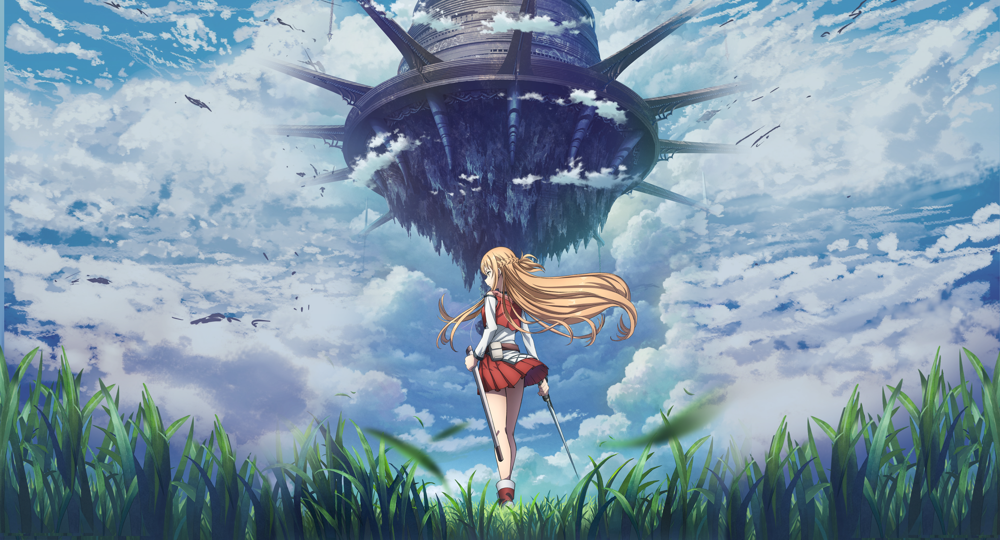
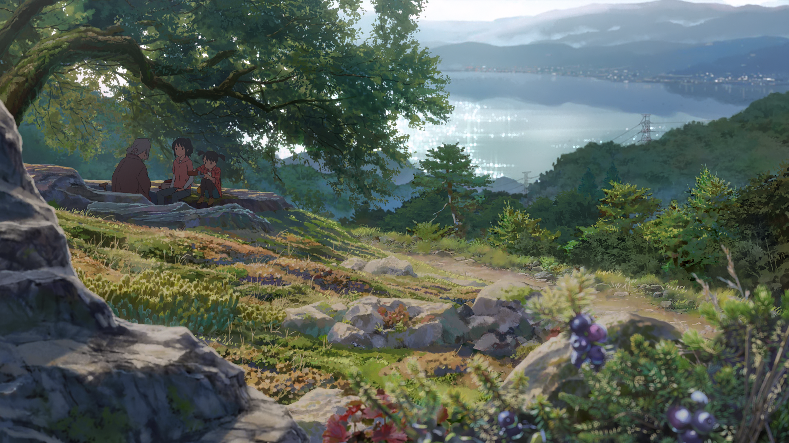
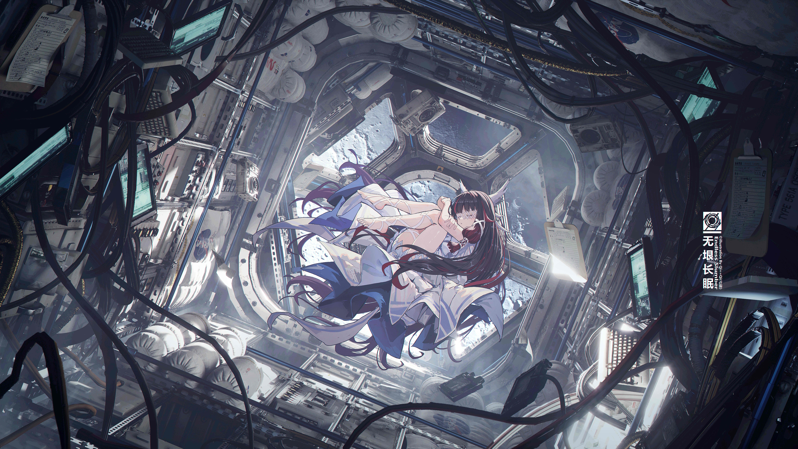
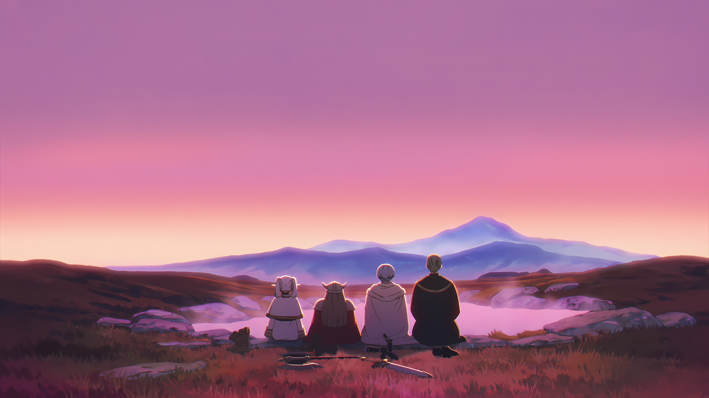
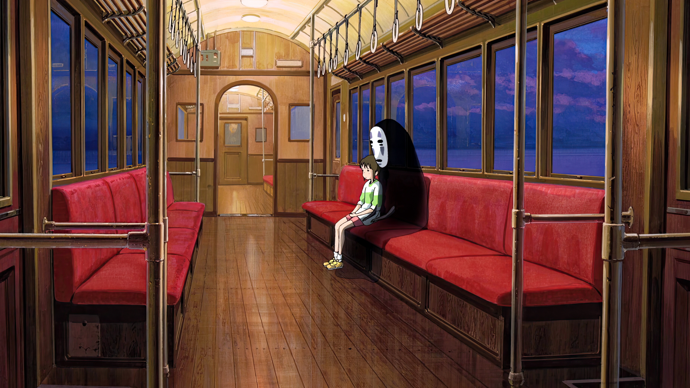
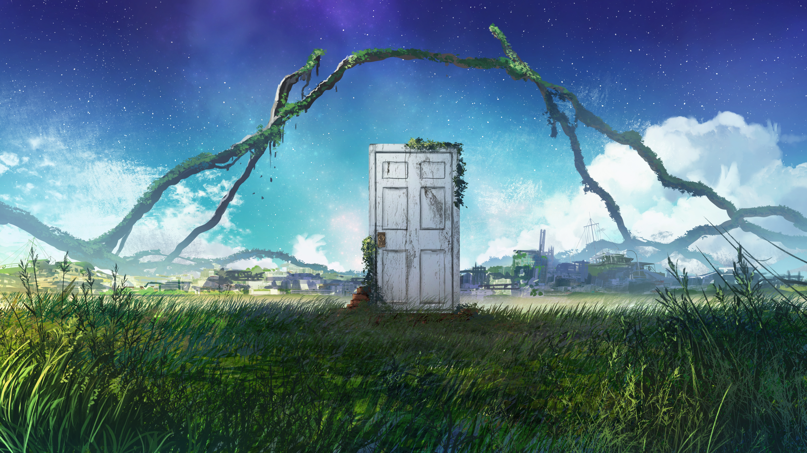
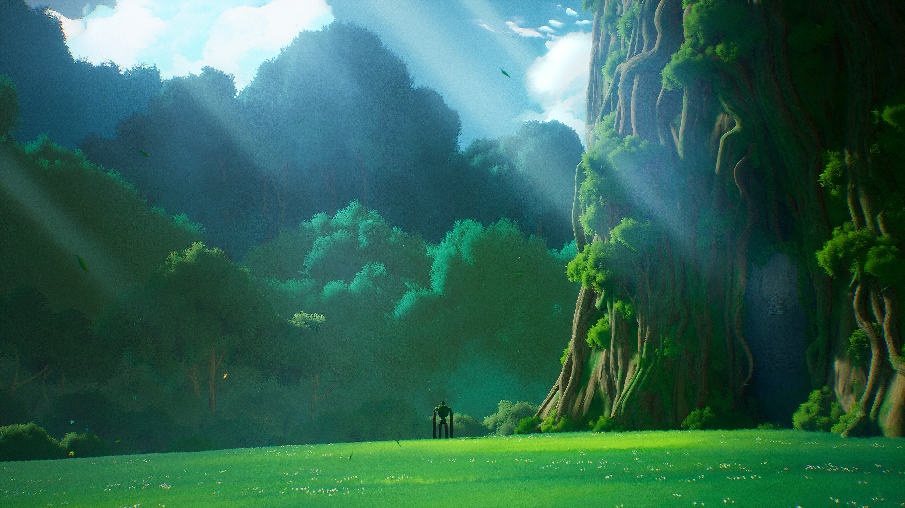
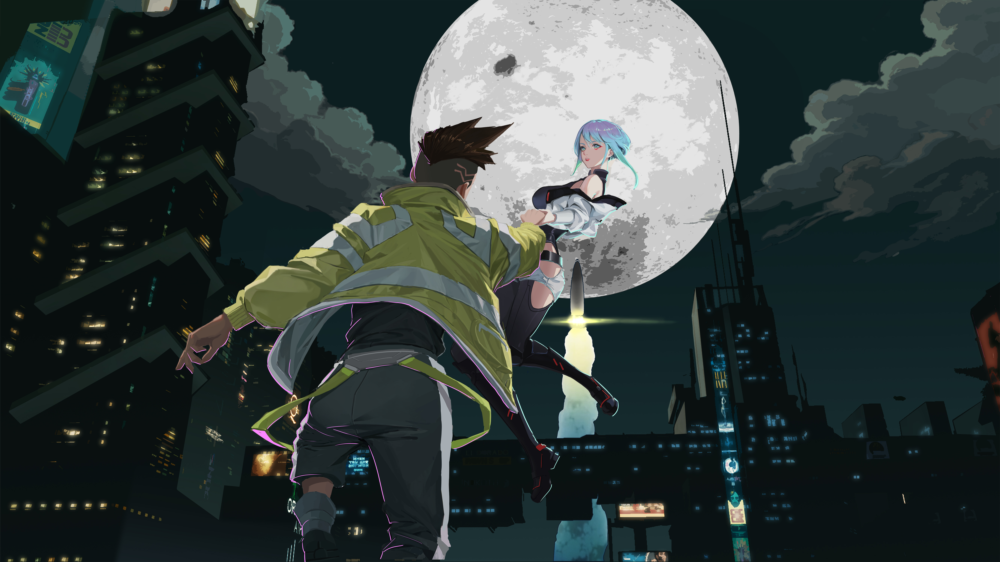
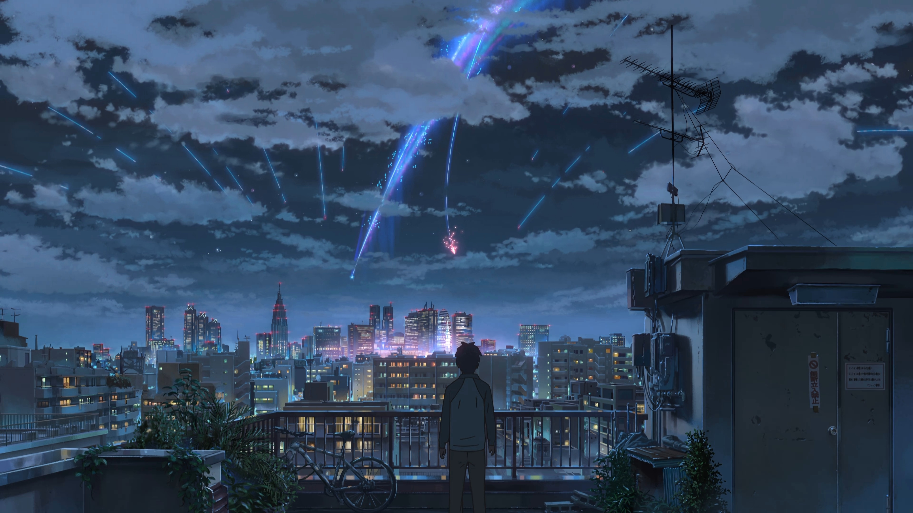

# Komorebi — Scenery-First Anime Aesthetic Theme for Omarchy

> **Komorebi** *(木漏れ日)* — The poetic Japanese concept for *sunlight filtering through trees*.

An anime-inspired theme crafted for **Omarchy | Hyprland**, featuring **12 iconic 4K & 8K scenery-first environmental landscape wallpapers** paired with a luminous OLED-optimized color palette, dynamic glowing anime gradient borders, and smooth spring physics animations.

---

## Wallpaper Gallery Previews

| 01. Asuna — Sunlit Meadow (4K) | 02. Mitsuha — Lake Itomori Sunset (4K) |
| :---: | :---: |
|  |  |

| 03. Columbina — Celestial Snow (8K) | 04. Frieren — Blue Flower Field (4K) |
| :---: | :---: |
|  |  |

| 05. Violet Evergarden — Water Meadow (8K) | 06. Spirited Away — Sea Railway Train (4K) |
| :---: | :---: |
|  |  |

| 07. Suzume — Cosmic Starry Twilight (4K) | 08. Weathering With You — Sunshine Clouds (8K) |
| :---: | :---: |
|  |  |

| 09. Castle in the Sky — Floating Laputa (4K) | 10. Cyberpunk Edgerunners — Moon Skyline (5K) |
| :---: | :---: |
|  |  |

| 11. Demon Slayer — Wisteria Mountain (4K) | 12. Your Name — Twin Comet Twilight (4K) |
| :---: | :---: |
|  |  |

---

## Features

- **12 Curated 4K & 8K Environmental Masterpieces:**
  - Scenery-first anime landscapes where the character and nature naturally harmonize.
- **Glowing Tri-Color Anime Gradient Borders:**
  - Active window borders feature a 45° luminous gradient transition: *Asuna Solar Orange* ↔ *Columbina Moon Blue* ↔ *Mitsuha Ribbon Crimson*.
- **Glassmorphism / Frosted Acrylic Effect:**
  - Multi-pass background blur with subtle transparency so scenic anime nature glows through windows.
- **Snappy Anime Spring Animations:**
  - Fast, responsive bezier physics transitions (`animeEase`) for windows, workspaces, and popups.
- **Luminous OLED-Optimized Color Palette:**
  - Deep velvet night canvas (`#0a0d14`) with high-contrast starlight white text (`#f1f5f9`) and vibrant character accents.

---

## Color Palette

| Color | Hex | Description |
| :--- | :--- | :--- |
| **Background** | `#0a0d14` | Deep velvet celestial canvas |
| **Foreground** | `#f1f5f9` | Crisp starlight mist white |
| **Accent** | `#ff6d00` | Asuna Solar Orange Flare |
| **Cursor** | `#ffd600` | Solar gold / comet light |
| **Selection** | `#004b87` | Columbina deep celestial blue |
| **Green** | `#00e676` | Mitsuha Lake Itomori emerald |
| **Blue** | `#00b0ff` | Columbina electric moon blue |
| **Red** | `#ff2a55` | Mitsuha braided ribbon crimson |
| **Magenta** | `#d500f9` | Celestial aurora neon purple |
| **Cyan** | `#00e5ff` | Electric aqua stream |

---

## Keyboard Shortcuts

| Shortcut | Action |
| :--- | :--- |
| `SUPER + CTRL + SPACE` | **Interactive Wallpaper Switcher GUI** |
| `SUPER + SHIFT + CTRL + SPACE` | **Theme Selector Menu** |
| `SUPER + SPACE` | **Omarchy Root Menu** |
| `SUPER + ALT + SPACE` | **Walker / Apps Launcher** |
| `SUPER + ENTER` | **Launch Terminal** (with frosted glass blur) |

---

## Installation

### Terminal (Recommended)

Run the Omarchy theme installer:

```bash
omarchy theme install https://github.com/Madhukumar511/omarchy-komorebi-theme.git
```

### Walker Menu

1. Copy the repo link: `https://github.com/Madhukumar511/omarchy-komorebi-theme.git`
2. Open Walker / Omarchy menu (`SUPER + ALT + SPACE` or `SUPER + SPACE`)
3. Navigate: **Install > Style > Theme**
4. Paste URL and press **Enter**

---

## Wallpaper Cycling

Cycle between all 12 anime scenery wallpapers anytime via terminal:

```bash
omarchy theme bg next
```

Or press `SUPER + CTRL + SPACE` to open the visual thumbnail switcher.

---

## License

MIT License. Free to use and customize.
